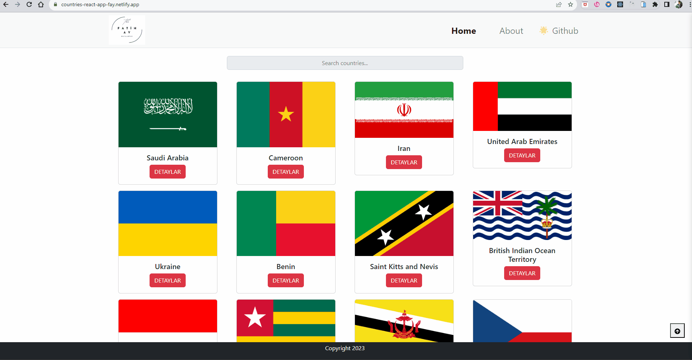
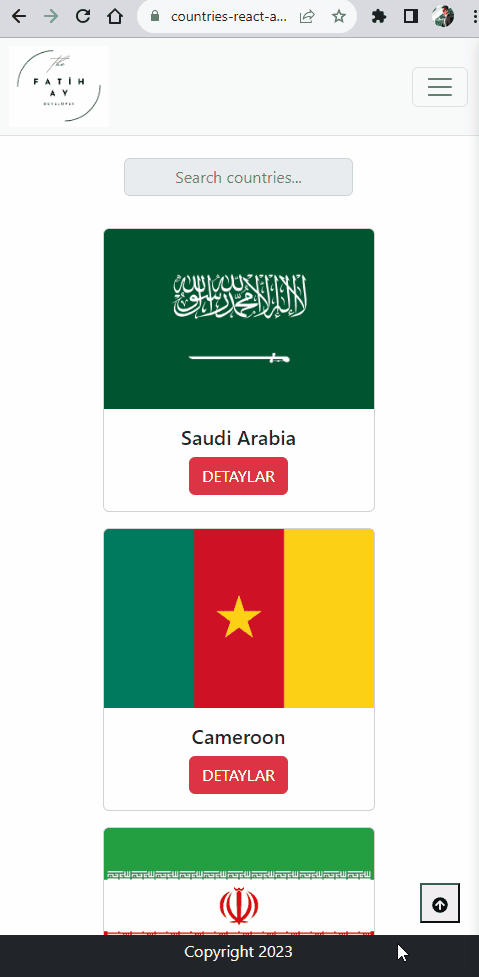

# Countries App

## Live Link: https://countries-react-app-fay.netlify.app/

## Description

Welcome to the "Countries App"! This application is designed to provide users with easy access to country information through a search feature. With this app, users can explore and retrieve essential details about various countries, including their locations on the map. Discover fascinating facts and explore the world at your fingertips. Happy exploring!

## Features

- <span style="font-size: larger;">**Search Functionality**</span>: Easily search and find information about specific countries using the search bar.
- <span style="font-size: larger;">**Country Details**</span>: Access comprehensive details about each country, including its capital, population, area, languages spoken, and more.
- <span style="font-size: larger;">**User-Friendly Interface**</span>: Enjoy a smooth and intuitive user interface for seamless navigation and information retrieval.
- <span style="font-size: larger;">**Responsive Design**</span>: Enjoy a smooth and intuitive user experience on various devices, including desktops, tablets, and mobile phones.

## Project Skeleton

```
.
├── README.md
├── countries.gif
├── countries1.gif
├── package-lock.json
├── package.json
├── public
│   ├── favicon.ico
│   ├── index.html
│   └── robots.txt
└── src
    ├── App.css
    ├── App.js
    ├── components
    │   ├── footer
    │   │   ├── Footer.css
    │   │   └── Footer.jsx
    │   └── navbar
    │       └── MyNavbar.jsx
    ├── img
    │   └── [Your files...]
    ├── index.js
    └── pages
        ├── about
        │   └── About.jsx
        ├── details
        │   └── Details.jsx
        ├── home
        │   └── Home.jsx
        └── notFound
            └── NotFound.jsx
```

## Expected Outcomes

<div >


</div>

## Technologies and Libraries

- <span style="font-size: larger;">**React.js**</span>: A powerful JavaScript library for building interactive user interfaces.
- <span style="font-size: larger;">**RESTful API**</span>: Utilized to fetch country data from external sources and provide real-time information.
- <span style="font-size: larger;">**Fetch API**</span>: A modern web API used to make network requests and handle responses, such as fetching country data from APIs.
- <span style="font-size: larger;">**Bootstrap**</span>: A highly customizable CSS framework for creating stunning designs with minimal effort.
- <span style="font-size: larger;">**React Router**</span>: A popular routing library for React applications, allowing for dynamic and intuitive navigation between different pages within the application.
- <span style="font-size: larger;">**Font Awesome:**</span>: Provides a wide range of icons used for visual elements.

## Getting Started

To run the application on your local machine, follow these steps:

1. Clone the project to your computer:

   ```
   git clone https://github.com/iamfatihay/Countries-App.git
   ```

2. Open your terminal and navigate to the project directory.
   ```
   cd countries-app
   ```
3. Install the dependencies:
   ```
   npm install
   ```
4. Start the application:
   ```
   npm start
   ```
5. Open your web browser and visit **http://localhost:3000** to explore the Countries Application.

## Contribution

Welcome contributions to enhance the Countries Application! If you find any bugs or have ideas for improvements, please open an issue or submit a pull request. I appreciate your valuable input!

## License

The Countries Application is licensed under the [MIT License](LICENSE). Feel free to use, modify, and distribute the code as per the terms of the license.
